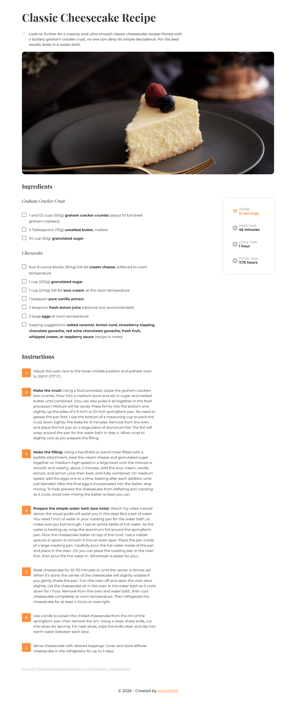

## RECIPE BLOG CHALLENGE

## Le challenge

Création d'une page de recette en HTML5, CSS3 et Javascript qui doit répondre à un cahier des charges :

- La page web doit être responsive.
- Consultation d'une recette avec ses ingrédients et ses instructions.
- Possibilité de cocher une case si l'internaute possède les ingrédients.
- Voir le nombre de portions et les temps de cuisson

## Démonstration

Lien vers le projet : https://aperbet56.github.io/recipe_blog/

## Projet développé avec

- Utilisation des balises sémantiques HTML5
- CSS3
- Flexbox
- Animations CSS
- Page web responsive
- Desktop first
- Commentaires HTML
- Commentaires CSS
- Importation des polices "Montserrat" et "Playfair Display"
- Utilisation d'un normaliseur : le fichier normalize.css
- JavaScript
- Code JavaScript commenté
